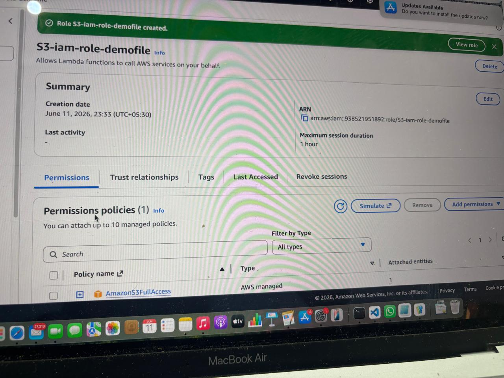
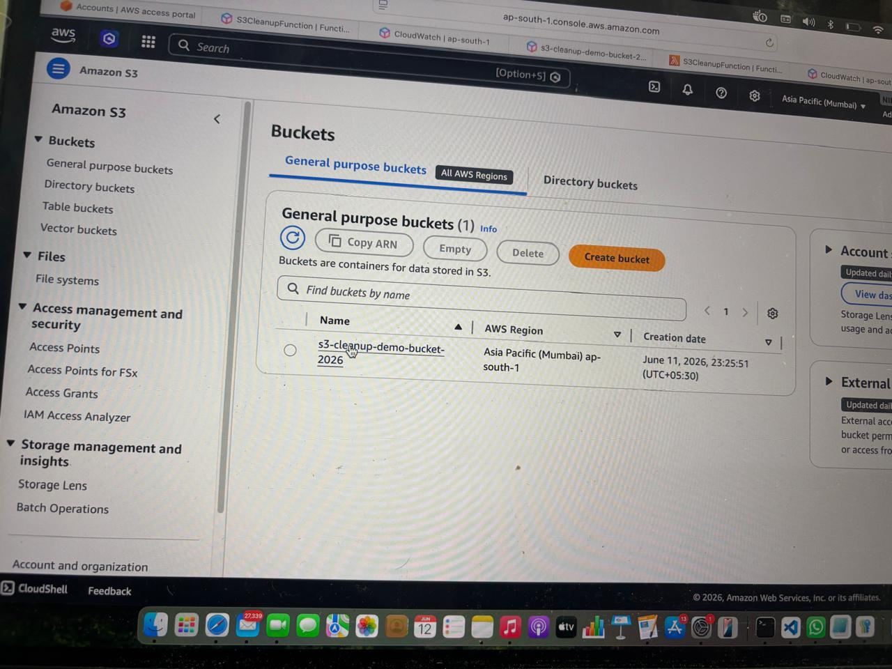
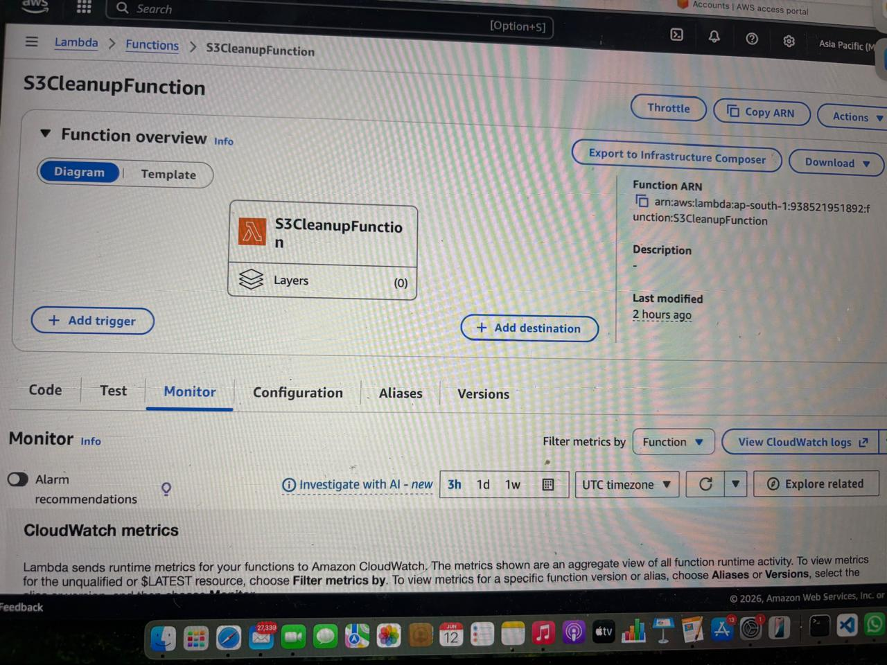
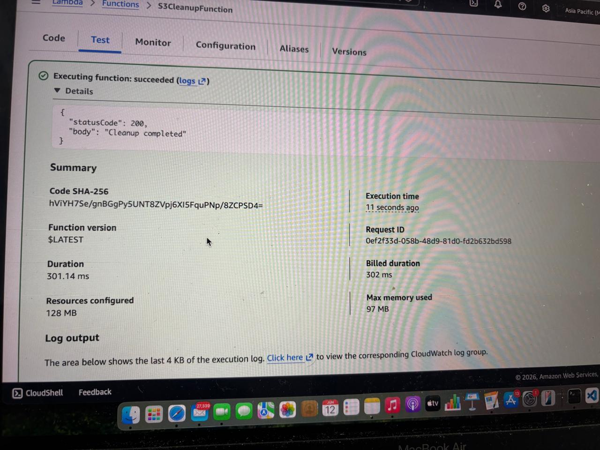
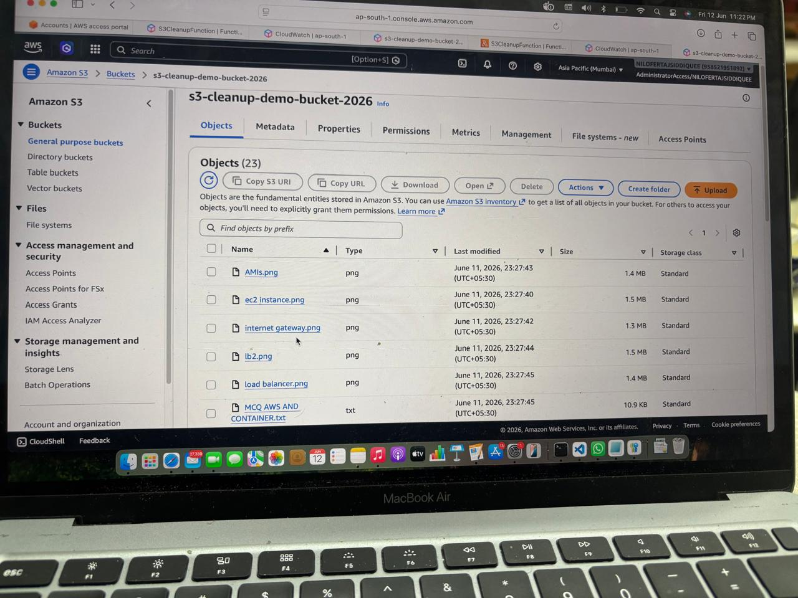

# Assignment 2: Automated S3 Bucket Cleanup Using AWS Lambda and Boto3

## Objective

To automate the deletion of files older than 30 days from an Amazon S3 bucket using AWS Lambda and Boto3.

## AWS Services Used

* Amazon S3
* AWS Lambda
* IAM
* CloudWatch
* Boto3

## Implementation Steps

### S3 Bucket Creation

### IAM Role

### Lambda Function

### Test Event

### Successful Execution

### CloudWatch Logs

## Result

The Lambda function successfully identified and deleted objects older than 30 days from the specified S3 bucket.

## Conclusion

Successfully implemented automated S3 bucket cleanup using AWS Lambda and Boto3.
